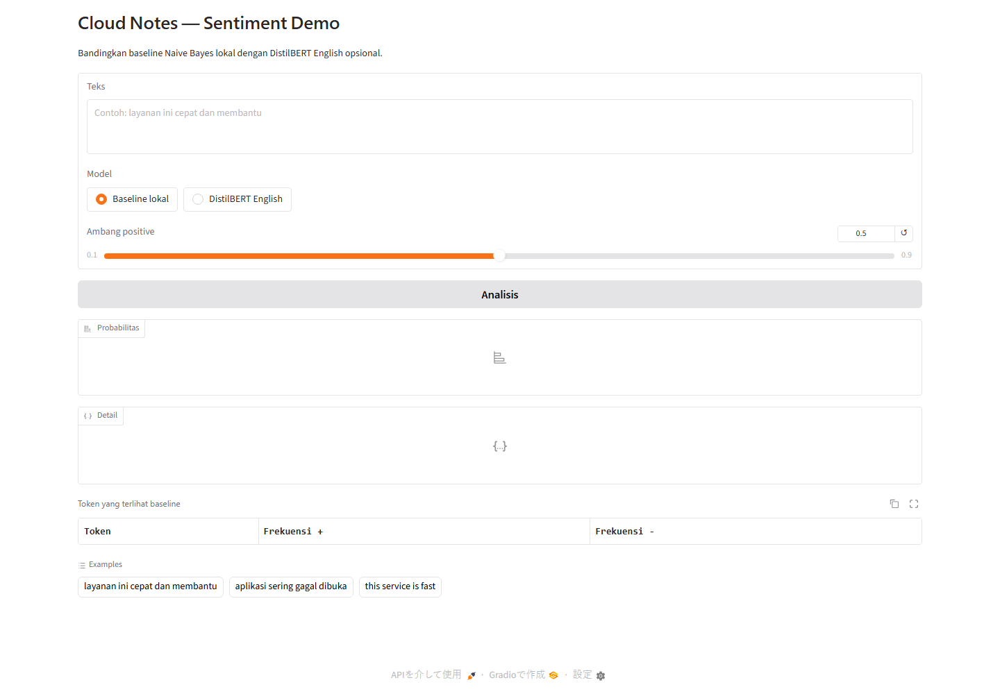
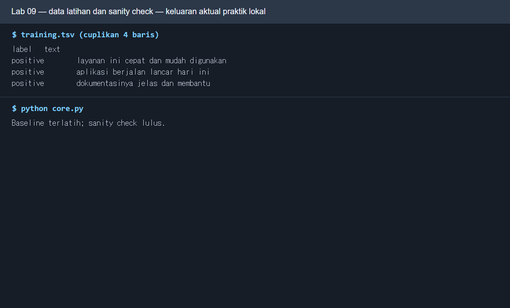
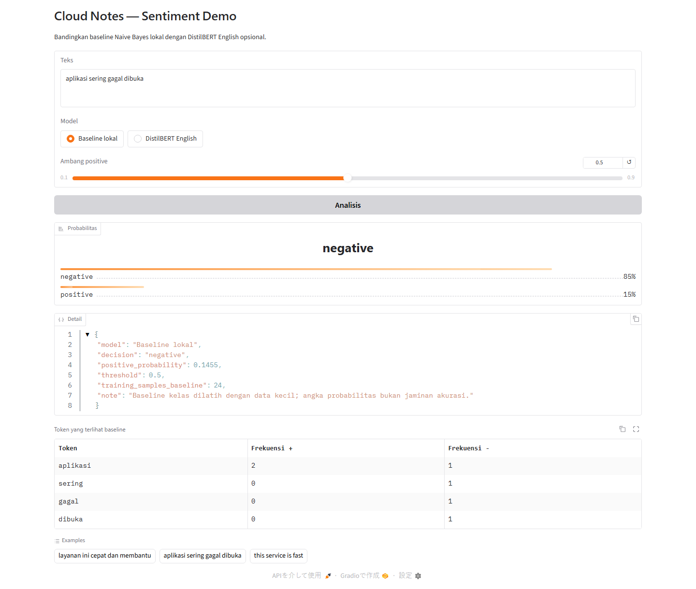
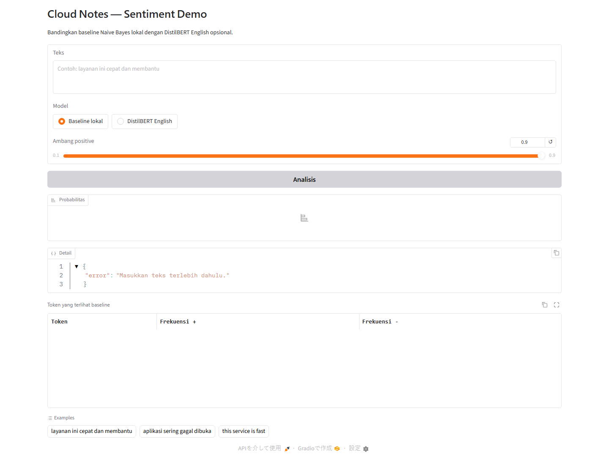
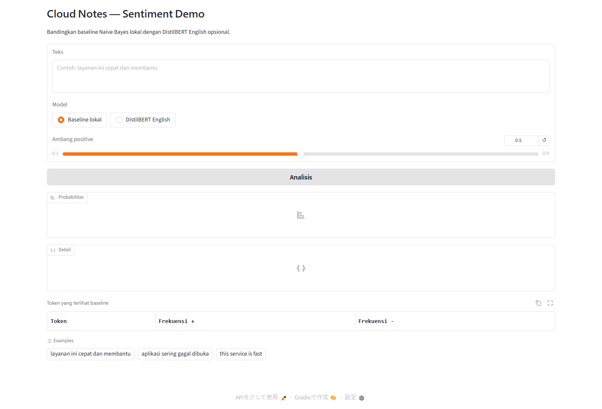
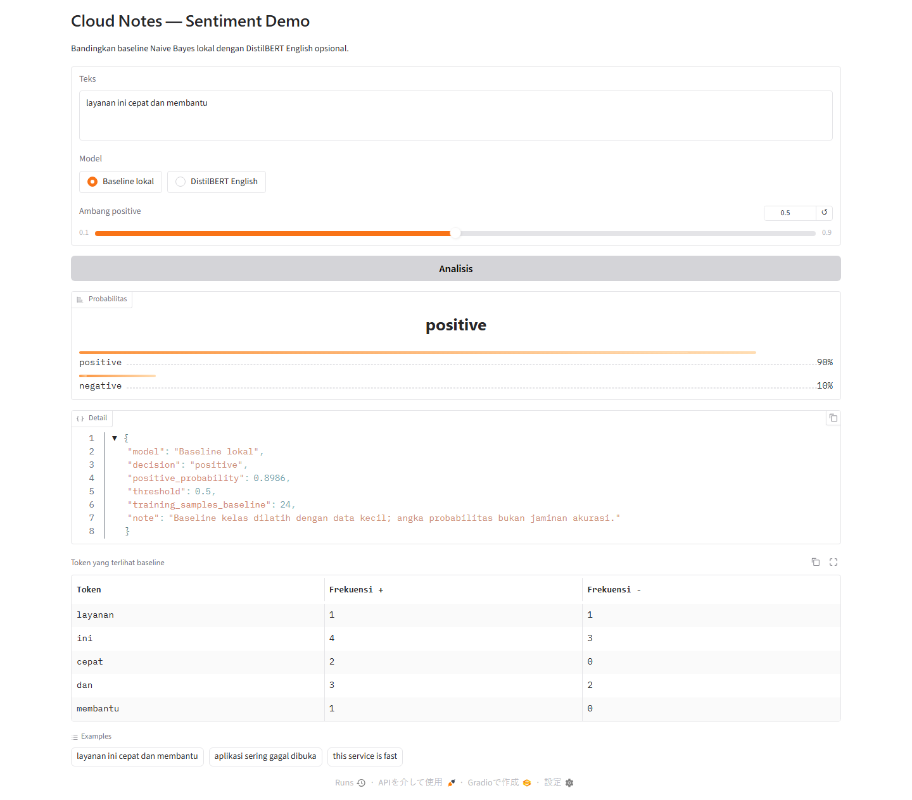
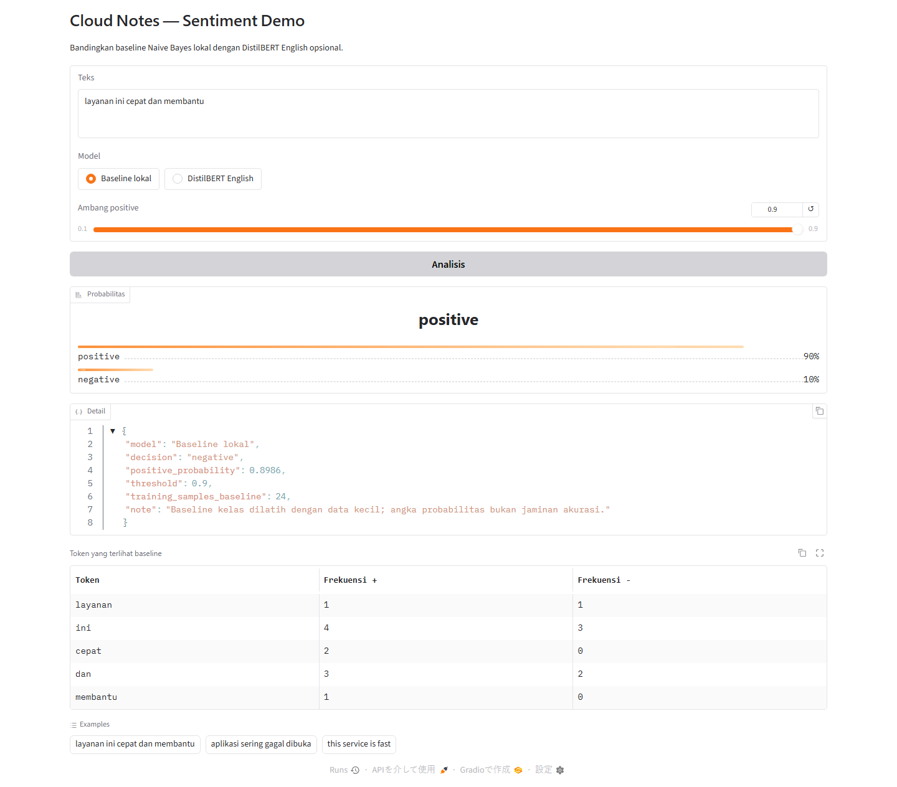
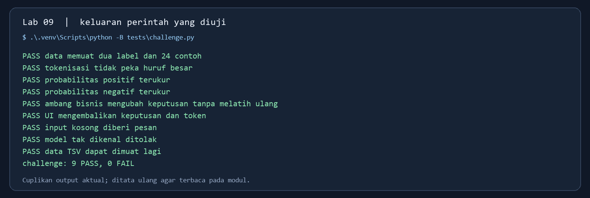
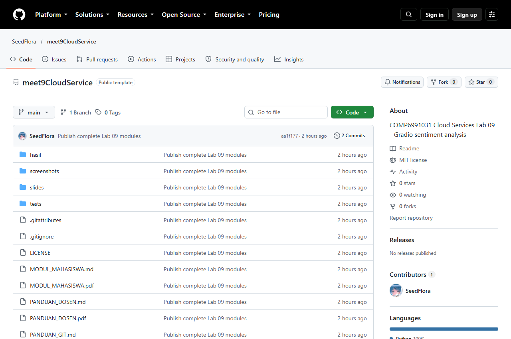

# Modul Mahasiswa Lab 09 — Sentiment dengan Gradio

**Kebijakan kelas:** Lab ini latihan formatif, tanpa tugas, nilai, atau penyerahan terpisah. Satu proyek besar dikerjakan oleh kelompok **3 orang**, dengan presentasi checkpoint minggu 7 (UTS) dan hasil akhir minggu 14 (UAS). Simpan hasil lab hanya bila berguna sebagai referensi atau bukti proses proyek. Baca [brief proyek kelompok](PROYEK_KELOMPOK.md). Bobot resmi tetap mengikuti RPS/LMS.

**Sesi RPS:** 9 · **Mode utama:** Python lokal · **Bukti latihan opsional untuk proyek:** kode, perbandingan model, bukti UI, dan commit Git.

**Jenis bukti visual:** gambar Gradio dan GitHub adalah tangkapan browser dari aplikasi/repo yang berjalan. Gambar keluaran terminal berlatar gelap menyajikan ulang teks hasil perintah yang benar-benar dijalankan agar terbaca; itu bukan screenshot terminal langsung. Jalur DistilBERT/Space opsional tidak memiliki screenshot hasil yang diverifikasi di sini.

## Tujuan dan konsep

Anda akan menjalankan UI machine learning yang menerima teks dan menampilkan label, probabilitas, detail, serta token. `core.py` melatih Naive Bayes kecil dari `training.tsv` sebagai baseline. `app.py` membungkusnya dalam Gradio; DistilBERT English adalah pembanding opsional yang perlu unduhan model. Setelah lab, bedakan data latih, inferensi, ambang keputusan, waktu muat pertama, dan waktu prediksi berikutnya.

Slide sesi 9 juga menunjukkan sketsa `sentiment_test.py` dan halaman ML Next.js sebagai perluasan. Proyek yang disediakan untuk praktik kelas adalah `core.py` dan `app.py` di folder ini.



* **Langkah:** Jalankan `python app.py`, buka URL Gradio lokal, isi teks, pilih model, atur slider, lalu klik **Analisis**. **Fungsi:** Mengenalkan input dan keluaran klasifikasi sentimen. **Cara kerja:** UI memanggil fungsi prediksi pada `core.py` dan menampilkan probabilitas, keputusan, detail, serta token. **Baca hasil:** Temukan kotak teks, pilihan mode, ambang, tombol, dan panel hasil sebelum mengubah parameter.

*Gambar 1. Kenali kotak teks, pilihan model, slider, tombol Analisis, dan panel hasil.*

## Persiapan dan menjalankan baseline

Gunakan Python 3 dan akses internet hanya untuk memasang dependency pertama kali. Dari root repo Lab 09 pada PowerShell:

```powershell
python -m venv .venv
.\.venv\Scripts\python -m pip install -r requirements.txt
.\.venv\Scripts\python core.py
.\.venv\Scripts\python app.py
```

Pada Bash/WSL ganti interpreter dengan `.venv/bin/python` setelah `python3 -m venv .venv`. `core.py` harus menampilkan **sanity check lulus**. Buka `http://127.0.0.1:7860`.

## Praktik bertahap

1. **Baca data.** Buka `training.tsv`, hitung jumlah contoh dan dua label. Di `core.py`, temukan tokenisasi, hitung kata per label, smoothing, dan normalisasi probabilitas. Jangan menyimpulkan kualitas produksi hanya dari data latihan kecil.
2. **Prediksi baseline.** Pada UI pilih **Baseline lokal**, ambang 0,5. Uji `layanan ini cepat dan membantu` dan `aplikasi sering gagal dibuka`, lalu satu kalimat buatan sendiri. Catat dua probabilitas, keputusan, dan token pada tabel.
3. **Ubah ambang.** Naikkan ambang *positive* ke 0,8 atau 0,9 tanpa mengubah teks. Baca `decision` pada panel **Detail**: keputusan dapat berubah walau probabilitas tetap. Panel **Probabilitas** tetap menonjolkan kelas dengan skor tertinggi, sehingga pada ambang 0,9 ia dapat tampak `positive` sementara `Detail.decision` bernilai `negative`.
4. **Uji input kosong.** Klik Analisis tanpa teks. Panel detail harus memberi pesan agar teks dimasukkan. Bandingkan perilaku validasi UI dan fungsi `analyze`.
5. **Bandingkan model (opsional lokal).** Jika waktu, internet, RAM, dan disk memadai, instal dependency model:

```powershell
.\.venv\Scripts\python -m pip install -r requirements-transformer.txt
```

Pada Bash gunakan `.venv/bin/python`. Pilih **DistilBERT English** dan gunakan kalimat Inggris, misalnya `this service is fast and helpful`. Catat waktu pertama (download + load) dan waktu berikutnya. Model bahasa Inggris tidak boleh dinilai hanya dari contoh bahasa Indonesia.

### Tampilan pada setiap langkah

**Langkah 1 — data dan sanity check.** Gambar berikut menyajikan ulang baris data dan keluaran `core.py` dari uji lokal agar teks terbaca. Ini adalah visualisasi transkrip, bukan tangkapan layar terminal langsung.



* **Langkah:** Periksa `training.tsv` lalu jalankan `python core.py` dari root repo Lab 09. **Fungsi:** Memastikan data contoh dan sanity check model baseline siap. **Cara kerja:** Core memuat sampel, melatih Naive Bayes, lalu mencoba kalimat positif/negatif. **Baca hasil:** Baca jumlah sampel dan label/probabilitas contoh; hasil harus masuk akal sebelum membuka UI.

**Langkah 2 — dua hasil web.** Bandingkan keluaran teks positif dan negatif pada panel probabilitas, Detail, serta tabel token.


* **Langkah:** Di Gradio, masukkan kalimat positif dan klik **Analisis** pada mode baseline. **Fungsi:** Mengamati prediksi, probabilitas, dan alasan token. **Cara kerja:** Naive Bayes menggabungkan prior kelas dan bukti kata untuk menghitung skor sentimen. **Baca hasil:** Baca label positif, probabilitas sekitar 0,8986 pada contoh, Detail, dan tabel kontribusi token.



* **Langkah:** Ulangi **Analisis** dengan kalimat negatif pada mode baseline. **Fungsi:** Membandingkan respons model pada polaritas berbeda. **Cara kerja:** Kata dalam input menggeser skor kelas melalui bobot Naive Bayes. **Baca hasil:** Baca label negatif dan probabilitas sekitar 0,8545 pada contoh; nilai mesin dapat sedikit berbeda.

**Langkah 3 — ambang 0,9.** Skor positif sekitar 0,8986 tetap ditampilkan, sementara `Detail.decision` menjadi `negative`. Amati beda probabilitas dan aturan keputusan.


* **Langkah:** Geser ambang keputusan ke 0,9 dan analisis ulang contoh positif. **Fungsi:** Menunjukkan beda skor probabilitas dan keputusan bisnis. **Cara kerja:** Aturan ambang memberi label positif hanya bila skor positif mencapai nilai slider. **Baca hasil:** Skor sekitar 0,8986 tetap tampil tetapi `Detail.decision` berubah menjadi `negative`.

**Langkah 4 — input kosong.** Panel Detail menampilkan pesan validasi tanpa menghentikan aplikasi.



* **Langkah:** Kosongkan kotak teks Gradio lalu klik **Analisis**. **Fungsi:** Menguji validasi input UI/model. **Cara kerja:** Fungsi prediksi menolak string kosong dan mengembalikan pesan terstruktur tanpa mematikan server. **Baca hasil:** Baca pesan validasi pada panel Detail; aplikasi tetap bisa dipakai setelah input diperbaiki.

**Langkah 5 — model opsional.** Pilihan **DistilBERT English** berada pada UI di gambar pembuka modul. Jalankan hanya setelah dependency model terpasang; catat waktu dan hasil mesin Anda sendiri. Tidak ada screenshot hasil DistilBERT yang terverifikasi dalam modul ini karena jalur wajib kelas memakai baseline lokal.

## Pertanyaan untuk laporan

1. Mengapa contoh positif dan negatif pada data latih dapat membuat baseline yakin, tetapi belum membuktikan akurasi pada data baru?
2. Apa akibat menaikkan ambang keputusan positif bagi jumlah prediksi positif?
3. Mengapa waktu prediksi pertama DistilBERT lebih lama daripada prediksi setelah model siap?
4. Apa risiko membandingkan model bahasa Inggris dengan masukan bahasa Indonesia tanpa dataset evaluasi yang sesuai?

## Bukti, Git, dan jalur cloud

Salin [template hasil](hasil/TEMPLATE_LAPORAN.md) menjadi `hasil/lab09.md`. Sertakan tabel tiga teks dengan label/probabilitas/ambang, screenshot UI **hasil Anda sendiri**, tabel token, dan perbandingan latensi bila DistilBERT dicoba. Push source, `training.tsv`, dan laporan dari root repo:

```bash
git status --short
git add .
git diff --cached --name-only
git diff --cached --check
git commit -m "lab09: gradio sentiment dan evaluasi"
git push
```

Simpan bukti milik Anda di `hasil/bukti/` bila ada; laporan tetap perlu memuat bukti hasil sendiri. `.venv`, model cache, token, dan data pribadi tidak boleh ikut. Lihat [panduan Git](PANDUAN_GIT.md). Jika akun Hugging Face Space tersedia, ikuti [README Lab 09](README.md) untuk push Space; demo lokal dan GitHub tetap menjadi jalur kelas bila akses compute Space tidak tersedia.

## Selesai dan kendala umum

Hentikan Gradio dengan `Ctrl+C`. Jika port 7860 sudah dipakai, hentikan proses Gradio lama. Jika pilihan DistilBERT menunjukkan error instalasi, lanjutkan baseline dan catat keterbatasan. Jika unduhan model gagal, periksa koneksi atau jalankan hanya baseline; jangan menaruh token Hugging Face dalam repo atau URL Git.

## Challenge kerja sehari-hari: triase ulasan pelanggan — kunci lengkap

Bayangkan tim dukungan harus menandai ulasan positif dan negatif. Model baseline membantu menyortir contoh, sedangkan ambang 0,9 adalah aturan bisnis yang lebih ketat sebelum ulasan ditandai positif. Jalankan semua perintah dari root repo ini. Challenge tidak membutuhkan akun Hugging Face atau model besar.

1. **Periksa bahan pelatihan.** Jalankan `Get-Content .\training.tsv | Select-Object -First 5` di PowerShell atau `head -n 5 training.tsv` di Bash. Baris pertama berisi `label` dan `text`, lalu contoh `positive`. Ada 24 contoh, masing-masing 12 per label. `core.py` membaca TSV itu dan melatih model setiap kali program dimulai.
2. **Uji baseline tanpa web.** Jalankan `.\.venv\Scripts\python core.py` (PowerShell) atau `.venv/bin/python core.py` (Bash). Keluaran `sanity check lulus` berarti dua contoh dasar terklasifikasi masuk akal. Ini belum mengukur akurasi pada data baru.
3. **Jalankan dan lihat web.** Jalankan `.\.venv\Scripts\python app.py` atau `.venv/bin/python app.py`. Buka `http://127.0.0.1:7860`. Pilih **Baseline lokal**, ketik `layanan ini cepat dan membantu`, ambang 0,5, lalu **Analisis**. Hasil uji lokal: probabilitas positif sekitar 0,8986 dan `decision=positive`.
4. **Uji ulasan negatif.** Ganti teks dengan `aplikasi sering gagal dibuka`. Hasil uji lokal: probabilitas negatif sekitar 0,8545. Kata pada tabel adalah token yang masuk perhitungan baseline; jumlah kemunculan kata dalam data latihan bukan penjelasan kausal.
5. **Naikkan ambang.** Kembalikan teks positif pertama, ubah ambang ke 0,9, klik **Analisis**. Probabilitas positif tetap sekitar 0,8986, tetapi `Detail.decision=negative` karena 0,8986 kurang dari 0,9. Panel probabilitas tetap menampilkan skor model; untuk keputusan operasional gunakan `Detail.decision`.
6. **Uji input buruk.** Hapus teks dan klik **Analisis**. `Detail.error` berisi pesan memasukkan teks. Pilihan model yang tidak dikenal juga ditolak oleh fungsi `analyze`, meskipun radio UI normal hanya menawarkan dua pilihan yang sah.
7. **Jalankan pemeriksa.** Di terminal kedua, PowerShell: `.\.venv\Scripts\python -B tests\challenge.py`; Bash: `.venv/bin/python -B tests/challenge.py`. Harapkan `challenge: 9 PASS, 0 FAIL`. Skrip memeriksa data, tokenisasi, dua prediksi, ambang, hasil UI, dan validasi. Ia tidak mengunduh DistilBERT.



*Perintah/tindakan:* `python app.py`, lalu buka URL lokal. *Fungsi:* memastikan antarmuka menerima teks, mode model, dan ambang. *Cara kerja:* Gradio menghubungkan tombol Analisis ke `analyze` pada `app.py`. *Baca hasil:* empat input/kontrol dan panel keluaran tampil sebelum pengujian.



*Perintah/tindakan:* isi contoh positif dan klik **Analisis**. *Fungsi:* melihat skor serta token. *Cara kerja:* `core.py` menghitung peluang Naive Bayes; `app.py` membentuk label, JSON detail, dan tabel. *Baca hasil:* skor positif sekitar 0,8986 dan keputusan positif pada ambang 0,5.



*Perintah/tindakan:* ubah ambang ke 0,9 dan klik **Analisis** lagi. *Fungsi:* membedakan skor model dari keputusan bisnis. *Cara kerja:* `decide()` membandingkan skor positif dengan ambang tanpa melatih ulang model. *Baca hasil:* `positive_probability` tetap sekitar 0,8986, `decision` menjadi `negative`.



*Perintah/tindakan:* `.\.venv\Scripts\python -B tests\challenge.py` atau `.venv/bin/python -B tests/challenge.py`. *Fungsi:* memeriksa data, model, ambang, dan validasi. *Cara kerja:* skrip menjalankan sembilan assertion tanpa model besar. *Baca hasil:* 9 PASS, 0 FAIL; cuplikan output aktual ditata ulang untuk modul.



*Perintah/tindakan:* setelah `git status --short`, `git add .`, pemeriksaan diff, dan `git push`, buka `https://github.com/SeedFlora/meet9CloudService`. *Fungsi:* memastikan berkas sumber, modul, slide, dan bukti dapat diakses dari repo kelas. *Cara kerja:* Git mengirim commit ke branch `main`; halaman GitHub menampilkan isi commit terakhir. *Baca hasil:* repo publik bertanda template dengan folder `screenshots`, `slides`, `tests`, serta PDF. Gambar ini adalah repo materi dosen, bukan bukti push repo pribadi mahasiswa.

### Jawaban pertanyaan laporan

1. Data latih hanya 24 contoh dan contoh uji mirip data latih. Nilai percaya pada data tersebut tidak mengukur generalisasi ke ulasan baru. Perlu data evaluasi terpisah, termasuk kelas yang seimbang dan bahasa yang sesuai.
2. Ambang positif yang lebih tinggi biasanya mengurangi jumlah keputusan positif dan dapat menurunkan false positive, tetapi meningkatkan risiko melewatkan ulasan yang sebenarnya positif. Ukur tradeoff pada data evaluasi.
3. Prediksi pertama DistilBERT mencakup unduhan checkpoint (jika cache kosong), pemuatan bobot, dan inisialisasi model. Prediksi berikutnya memakai objek model yang disimpan di memori `_transformer`.
4. Model DistilBERT yang dipilih dilatih untuk sentimen teks Inggris. Pengujian hanya dengan bahasa Indonesia dapat menghasilkan perbandingan yang tidak adil; gunakan dataset evaluasi per bahasa dan metrik yang sama.

**Bukti untuk laporan:** screenshot web milik Anda pada ambang 0,5 dan 0,9, teks negatif, keluaran pemeriksa, tabel kecil skor/keputusan, dan penjelasan mengapa baseline belum layak dipakai otomatis untuk keputusan penting. Screenshot contoh di atas berasal dari uji lokal proyek ini; hasil mesin Anda dapat berbeda.
